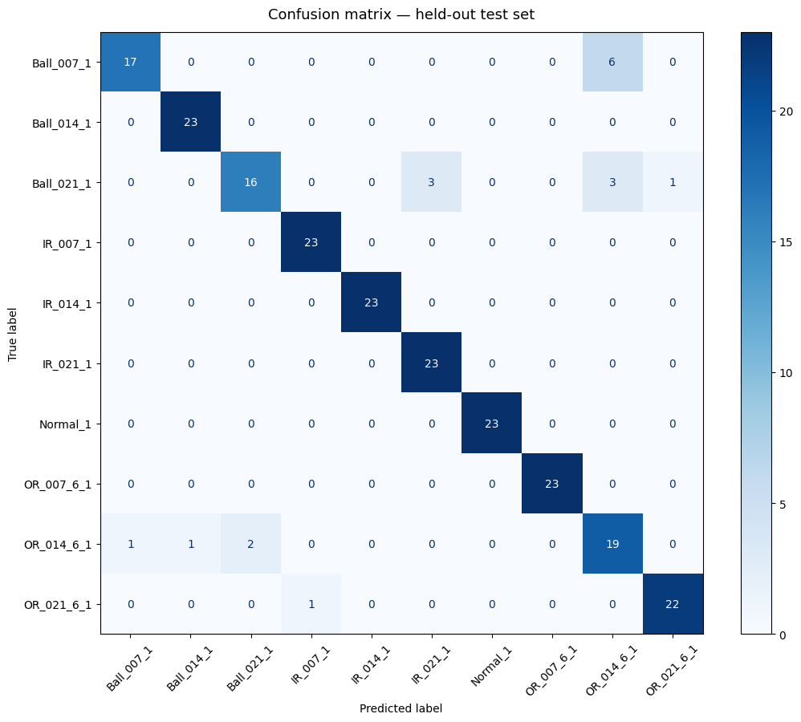
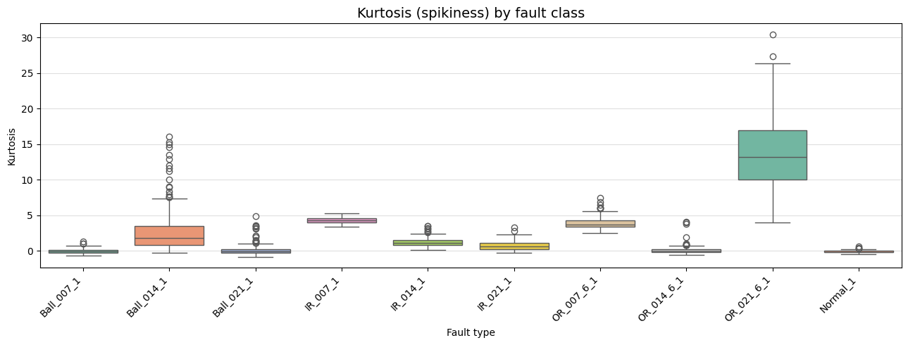
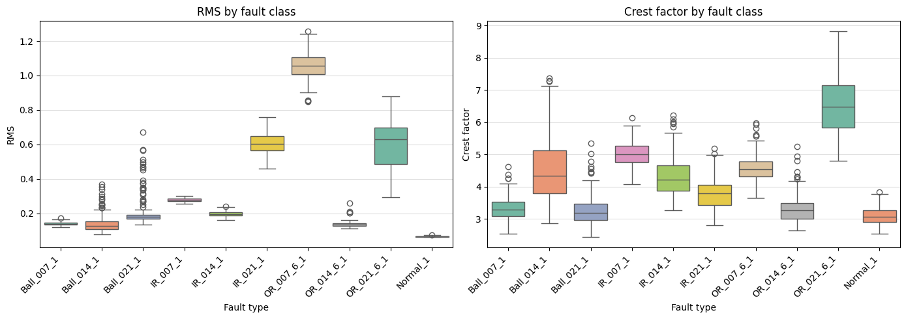
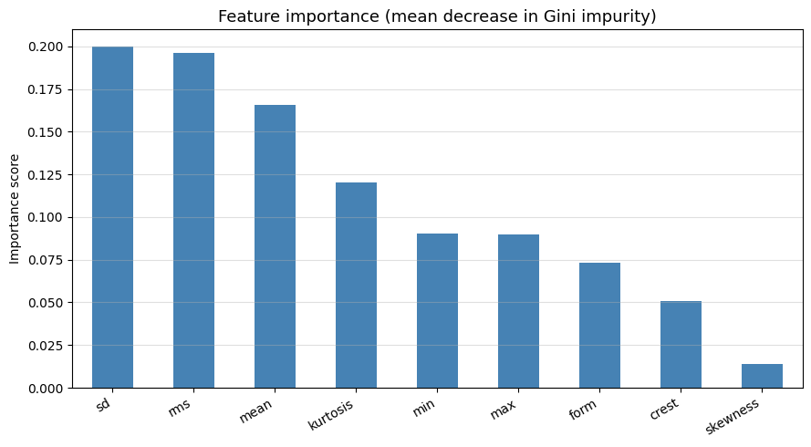

# 🔩 Bearing Fault Detection with Machine Learning


> **Predicting bearing faults in industrial motors using vibration signal statistics and Random Forest classification.**  
> Built on the CWRU (Case Western Reserve University) Bearing Dataset , a standard benchmark in predictive maintenance research.

---

## 📋 Table of Contents
- [Problem Statement](#-problem-statement)
- [Dataset](#-dataset)
- [Features](#-features)
- [Methodology](#-methodology)
- [Results](#-results)
- [What the Features Show](#-what-the-features-show)
- [Limitations](#️-limitations)
- [Project Structure](#-project-structure)
- [How to Run](#-how-to-run)
- [Next Steps](#-next-steps)

---

## 🎯 Problem Statement

Rolling-element bearing faults account for a large fraction of industrial motor failures. Early, automated fault detection prevents unplanned downtime and costly repairs.

This project builds a **multi-class classifier** that identifies which part of a bearing is damaged (ball, inner race, or outer race) and how severe the damage is, using only simple statistical features extracted from raw vibration signals.

**10 classes:** Healthy + 3 fault locations × 3 defect diameters (0.007", 0.014", 0.021")

---

## 📦 Dataset

[CWRU Bearing Data Center](https://engineering.case.edu/bearingdatacenter) — publicly available.

| Parameter | Value |
|---|---|
| Motor power | 2 HP |
| Shaft speed | 1772 rpm |
| Load | 1 HP |
| Sensor | Drive-end accelerometer |
| Sampling rate | 48 kHz |
| Window size | 2048 samples (~0.04 s) |
| Total windows | 2,300 |
| Fault classes | 10 |

Defects were introduced at a single point by EDM (electrical discharge) machining at 3 diameters across 3 bearing locations.

---

## 🔢 Features

Each 2048-sample window is compressed into 9 time-domain statistics:

| Feature | Definition | Why it matters |
|---|---|---|
| `max` | Peak positive amplitude | Captures extremes |
| `min` | Peak negative amplitude | Captures extremes |
| `mean` | Average value | Close to zero for vibration; mostly reflects sensor offset |
| `sd` | Standard deviation | Signal spread |
| `rms` | √(mean of squares) | Overall vibration energy |
| `skewness` | 3rd standardised moment | Signal asymmetry |
| `kurtosis` | 4th standardised moment (excess, so Gaussian = 0) | Impulsiveness from defect impacts |
| `crest` | Peak / RMS | Sensitive to isolated impacts |
| `form` | RMS / mean absolute | Waveform shape |

---

## 🧪 Methodology

### Pipeline

```
Raw CSV (2300 rows × 10 cols)
         │
         ▼
   Data Quality Check
   (null check, describe)
         │
         ▼
Exploratory Data Analysis
  - Kurtosis boxplot
  - RMS & Crest Factor plots
  - Feature correlation heatmap
         │
         ▼
  Stratified 90/10 Split
  (preserves class ratios)
         │
         ▼
  RandomForestClassifier
  (n_estimators=200, random_state=42)
         │
         ▼
     Evaluation
  - 5-fold stratified cross-validation
  - Per-class precision, recall, F1
  - Confusion matrix
         │
         ▼
  Feature Importance
  (Gini impurity decrease)
```

### Why Random Forest?
- Handles mixed-scale continuous features without normalisation
- Built-in feature importance
- Robust to outliers and small datasets
- Strong baseline for tabular structured data

---

## 📊 Results

All numbers below are the actual outputs of `bearing_fault_detection.ipynb`.

| Evaluation | Accuracy |
|---|---|
| 5-fold stratified cross-validation | **96.4% ± 0.8%** (folds: 96.3, 96.1, 97.8, 96.3, 95.4) |
| Held-out test set (230 windows, 23 per class) | **92.2%** (macro F1 0.92) |

### Per-class performance (held-out test set)

| Class | Precision | Recall | F1 |
|---|---|---|---|
| Normal | 1.00 | 1.00 | 1.00 |
| Ball 0.007" | 0.94 | 0.74 | 0.83 |
| Ball 0.014" | 0.96 | 1.00 | 0.98 |
| Ball 0.021" | 0.89 | 0.70 | 0.78 |
| Inner race 0.007" | 0.96 | 1.00 | 0.98 |
| Inner race 0.014" | 1.00 | 1.00 | 1.00 |
| Inner race 0.021" | 0.88 | 1.00 | 0.94 |
| Outer race 0.007" | 1.00 | 1.00 | 1.00 |
| Outer race 0.014" | 0.68 | 0.83 | 0.75 |
| Outer race 0.021" | 0.96 | 0.96 | 0.96 |

Healthy bearings and all inner-race faults are identified almost perfectly. Errors concentrate in three classes, **Ball 0.007", Ball 0.021" and Outer race 0.014"**, which are confused with one another. These are exactly the classes whose kurtosis stays near the healthy level (see below): without impulsive content, the time-domain statistics carry little to separate them.



---

## 📈 What the Features Show

### Kurtosis by fault class



Healthy windows sit at an excess kurtosis near 0, as expected for near-Gaussian vibration. Several faults are strongly impulsive (Outer race 0.021" has a median around 13), but kurtosis **does not rise monotonically with defect size**: Ball 0.021" and Outer race 0.014" look almost as Gaussian as the healthy bearing. This is a known limitation of kurtosis as a stand-alone indicator, and it explains where the classifier fails.

### RMS and crest factor



### Feature importance



| Feature | Importance |
|---|---|
| sd | 0.200 |
| rms | 0.196 |
| mean | 0.165 |
| kurtosis | 0.120 |
| min | 0.090 |
| max | 0.090 |
| form | 0.073 |
| crest | 0.051 |
| skewness | 0.014 |

Energy-based features (sd, rms) dominate. The high importance of `mean` is a warning sign rather than a finding: vibration has no physical mean, so this feature mostly captures the DC offset of each individual recording. The model may partly be recognising *which recording* a window came from, not the fault itself.

---

## ⚠️ Limitations

- **Optimistic split.** Windows are cut from one continuous recording per class and then split at random, so training and test windows come from the same recording. Accuracy on a new recording, a new bearing or a different load would be lower. A recording-level or load-level split (e.g. train on 0–2 HP, test on 3 HP) is the stricter test.
- **Single load condition** (1 HP) and a single sensor (drive end).
- **Time-domain features only.** Bearing faults are classically diagnosed from characteristic frequencies (BPFI, BPFO, BSF) in the envelope spectrum, which this model does not use.
- **Gini importance** is biased toward continuous, high-variance features and should be read with care.

---

## 📁 Project Structure

```
bearing-fault-detection/
│
├── bearing_fault_detection.ipynb     # Main notebook (this project)
├── feature_time_48k_2048_load_1.csv  # Pre-computed time-domain features (CWRU, 48 kHz, 1 HP)
├── figures/                          # Figures exported from the notebook outputs
└── README.md                         # This file
```

---

## ▶️ How to Run

### Option 1: Google Colab (easiest)

1. Open [Google Colab](https://colab.research.google.com)
2. Click **File → Upload notebook** → select `bearing_fault_detection.ipynb`
3. Upload `feature_time_48k_2048_load_1.csv` to the Colab session storage
4. Click **Runtime → Run all**

### Option 2: Local setup

```bash
# 1. Clone the repository
git clone https://github.com/uns-haider96/bearing-fault-detection.git
cd bearing-fault-detection

# 2. Install dependencies
pip install pandas numpy matplotlib seaborn scikit-learn jupyter

# 3. Launch Jupyter
jupyter notebook bearing_fault_detection.ipynb
```

### Dependencies

```
pandas >= 1.3
numpy >= 1.21
matplotlib >= 3.4
seaborn >= 0.11
scikit-learn >= 1.0
jupyter
```

---

## 🔭 Next Steps

| Idea | Impact |
|---|---|
| Recording- or load-level split (train 0–2 HP, test 3 HP) | Honest generalisation estimate |
| Test across all 4 load conditions (0–3 HP) | Generalisation |
| Add envelope-spectrum features at BPFI, BPFO, BSF | Separates the low-kurtosis faults |
| Drop `mean` (sensor offset) and re-evaluate | Removes a recording-identity shortcut |
| Replace Gini importance with SHAP values | More reliable attribution |
| Compare vs SVM, XGBoost, 1D-CNN on raw signals | Model selection |
| Evaluate robustness to artificial sensor noise | Real-world readiness |
| Extend to multi-sensor fusion (Drive + Fan end) | Higher accuracy |

---

## 📚 References

- [CWRU Bearing Data Center](https://engineering.case.edu/bearingdatacenter)
- Loparo, K.A. (2012). *Bearing Data Center*. Case Western Reserve University.
- Randall, R.B. & Antoni, J. (2011). *Rolling element bearing diagnostics — A tutorial*. Mechanical Systems and Signal Processing.

---

## 📄 License

MIT License — free to use, modify, and share with attribution.

---

*Built as part of a predictive maintenance study. Dataset credit: Case Western Reserve University.*
